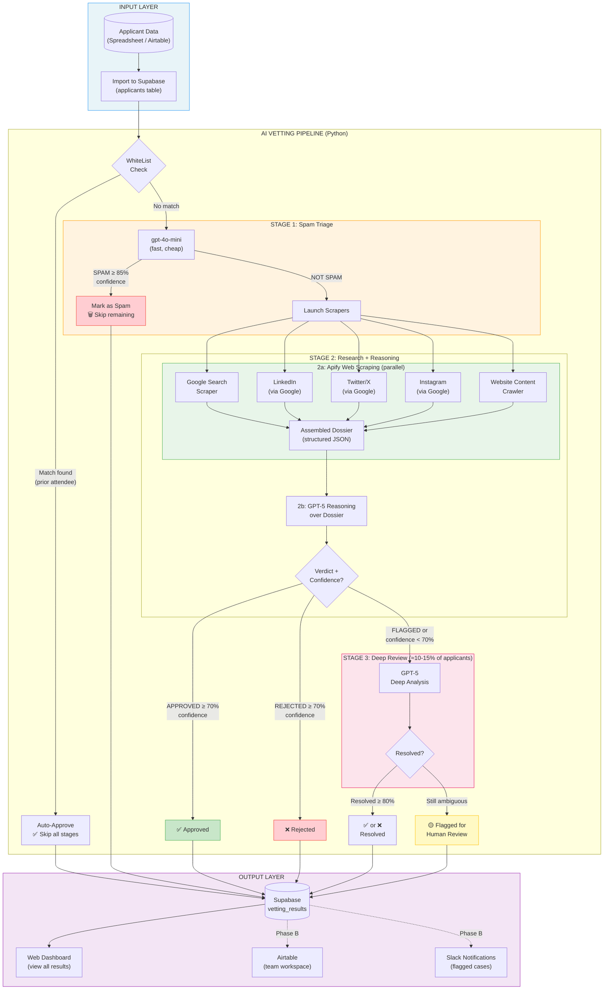

# HRF OFF Vettor v2 — System Architecture

## Data Flow Summary

| Stage | Model | Purpose | Cost/Applicant | ~% Processed |
|-------|-------|---------|----------------|-------------|
| WhiteList | None | Auto-approve prior attendees | $0 | ~25% |
| Stage 1 | gpt-4o-mini | Spam triage | ~$0.005 | 100% |
| Stage 2a | Apify actors | Web scraping (Google, social, org sites) | ~$0.03 | ~90% |
| Stage 2b | GPT-5 | Reasoning over dossier → verdict | ~$0.10 | ~90% |
| Stage 3 | GPT-5 | Deep review of ambiguous cases | ~$0.10 | ~10-15% |

## Per-Applicant Output
- **Verdict:** Approved / Flagged / Rejected / Spam
- **Confidence:** 0-100%
- **Scorecard:** What was confirmed / not found / concerning
- **Recommended next step:** Specific action for human reviewer
- **Full dossier:** All scraped data, URLs, Google results
- **Audit trail:** Which models ran, latency, cost
